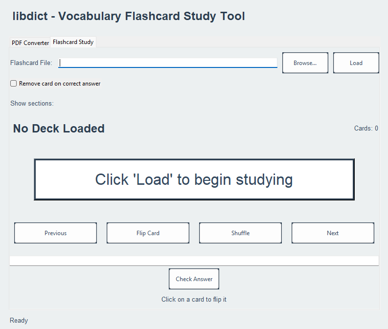
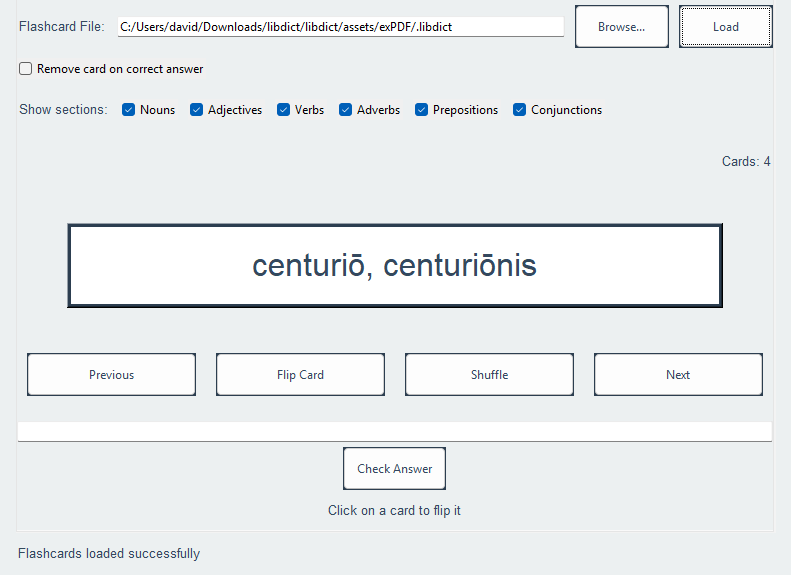

# 📚 LibDict  
*A minimal yet powerful library-based flashcard system for efficient studying.*

[](https://github.com/yourusername/libdict)  [](LICENSE)  [](https://www.python.org/)  []()  

---

## 🚀 Features

- 📄 **PDF to .libdict Conversion**  
  Convert any PDF into a `.libdict` file — a lightweight, structured format optimized for fast loading and sharing within LibDict.

- 🃏 **Flashcard System**  
  Practice efficiently with flashcards. Cards are visually displayed and can be cycled through with ease.

- 🔀 **Smart Shuffling**  
  Shuffle cards randomly for better memory retention and to avoid memorizing based on order.

- ✅ **Remove on Correct Answer**  
  Cards you've mastered get removed from the active pool, letting you focus on what really needs practice.

- 📂 **Custom Section Loader**  
  Load specific sections of your dictionary for focused study sessions.


## 🖼️ Screenshots  
<h2>PDF to .libdict conversion page.</h2>

<h2>Main Page, Unloaded</h2>

<h2>Main Page, Loaded with information</h2>



## 🔧 Installation  

  1. The *easy* way:
     - Download libdict.exe from the releases tab
     - Run libdict.exe
     - Voila!
  2. The **hard** way:
     - Clone the repo
        - ```bash
            git clone https://github.com/literal-gargoyle/libdict.git
            cd libdict
            python main.py
          ```
        * The program auto-installs dependencies. 
---

## 📁 File Format: `.libdict`

`.libdict` is a custom format that stores question-answer pairs along with optional metadata like tags or categories.

Example structure:
```json
{
  "format_version": "1.0",
  "title": "libdictExample",
  "sections": {
    "nouns": [
      {
        "term": "centuri\u014d, centuri\u014dnis",
        "definition": "centurion"
      }
    ],
    "adjectives": [
      {
        "term": "ing\u0113ns, ing\u0113ns, ing\u0113ns",
        "definition": "huge"
      }
    ],
    "verbs": [
      {
        "term": "c\u0113nat",
        "definition": "dines, to dine, dined"
      }
    ],
    "adverbs": [
      {
        "term": "nihil",
        "definition": "nothing"
      }
    ],
    "prepositions": [],
    "conjunctions": []
  }
}
```

---

## 🧑‍💻 Contributing  
Contributions are welcome! Open issues, create pull requests, or suggest features.  

---

## 📄 License  
This project is licensed under the MIT License. See [LICENSE](LICENSE) for more details.
